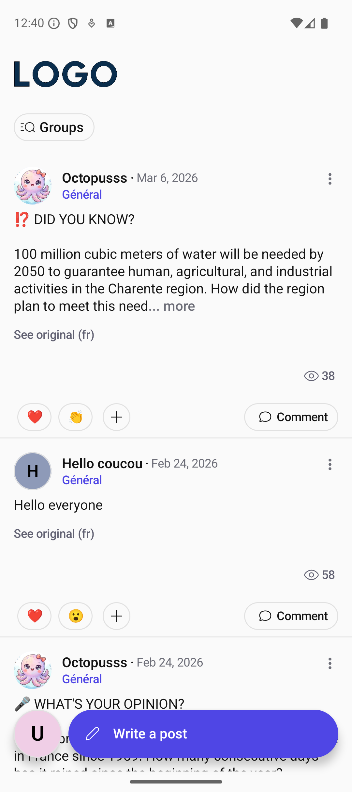
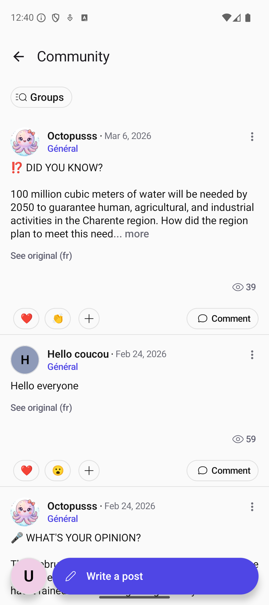
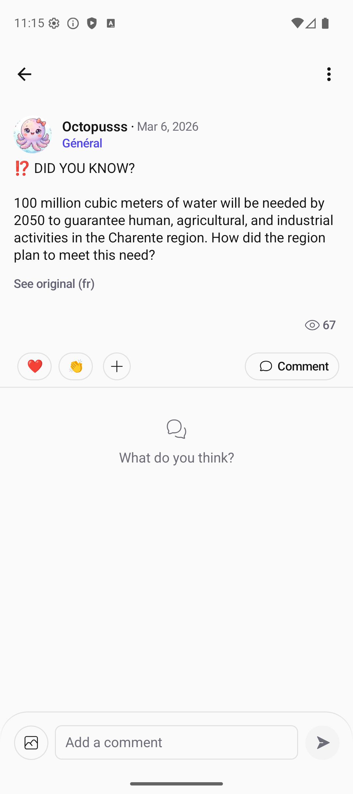
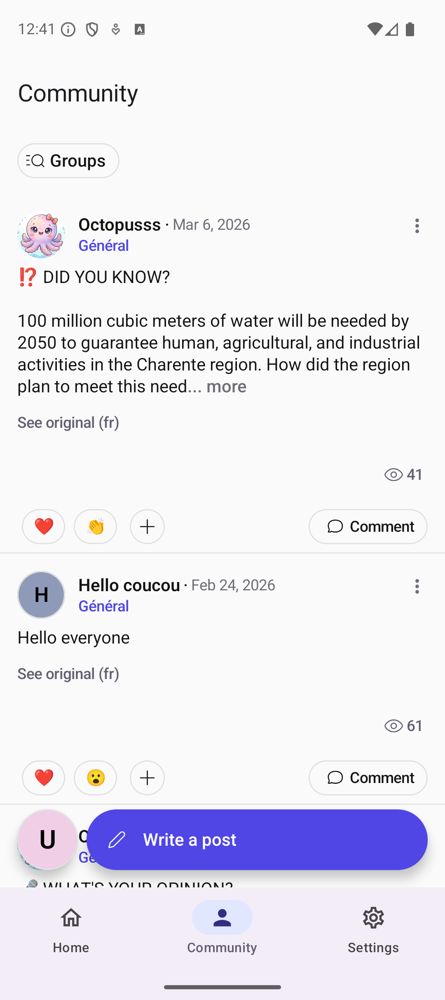
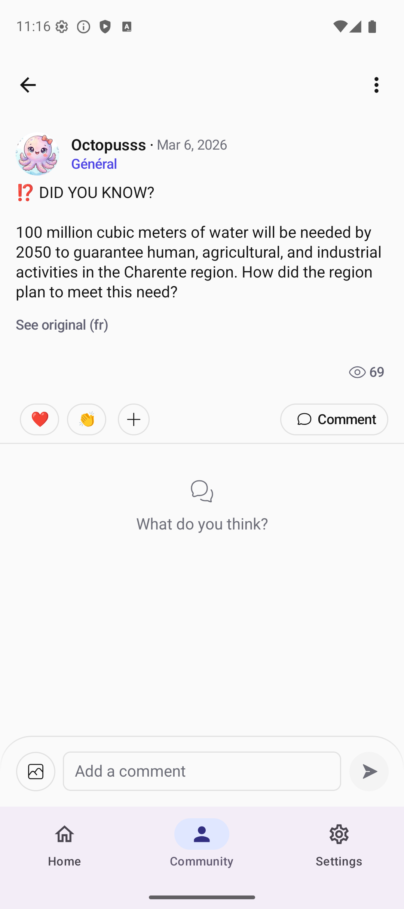
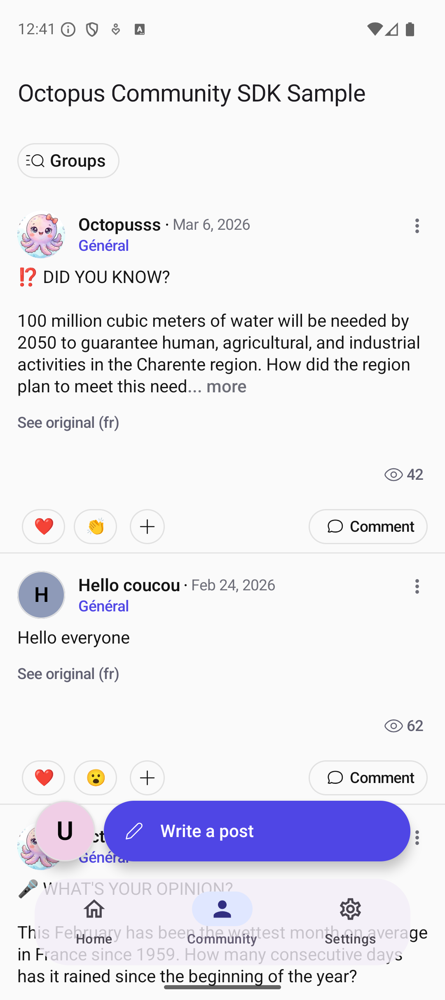
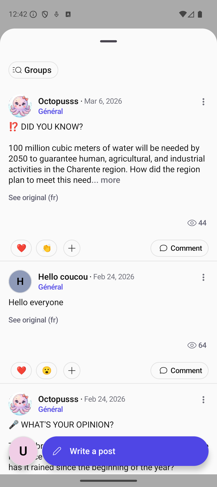

# Octopus SDK for Android

Octopus is an SDK that enables you to **integrate a fully customizable social network** into your app, perfectly **aligned with your branding**.

## Dependencies

Add the dependencies to your `build.gradle` file:

```kotlin
dependencies {
    // Core SDK functionalities
    implementation("com.octopuscommunity:octopus-sdk:1.10.2")
    // SDK UI Components (optional)
    implementation("com.octopuscommunity:octopus-sdk-ui:1.10.2")
}
```

*(Note: Octopus is available on Maven Central)*

## How to use the samples

### 1. Add your API Key and Client User Secret in the `local.properties`

Add those lines to the root project `local.properties` file:

```properties
OCTOPUS_API_KEY=YOUR_API_KEY
// To test the SSO connection mode, provide a Client User Token Secret
OCTOPUS_SSO_CLIENT_USER_TOKEN_SECRET=YOUR_USER_TOKEN_SECRET
```

- Replace `YOUR_API_KEY` with your own API key. See [Get an API Key](https://doc.octopuscommunity.com/) for more infos.
- Replace `YOUR_USER_TOKEN_SECRET` with your own Client User Token Secret. See [Generate a signed JWT for SSO](https://doc.octopuscommunity.com/backend/sso) for more info.

### 2. Choose the build variant corresponding to your UI Integration Mode

Depending on your targeted UI integration, choose how you want to integrate the Octopus Community UI into your app.

The SDK provides two main composables:
- **`OctopusHomeScreen`** — A complete screen with its own Scaffold and top bar. Drop it in and you're done.
- **`OctopusHomeContent`** — Just the content, without a Scaffold. Embed it inside your own layout (tabs, sheets, custom scaffolds).

Pick the pattern below that best matches your app's navigation:

---

#### 1. Single Activity (Standalone Community)

Use `OctopusHomeScreen` as the sole content of a dedicated Activity. Best when the community IS the app or is launched as a standalone screen.



**Best for:** Apps where the community is the primary (or only) feature.

- [Single Activity Sample](/samples/src/singleactivity/java/com/octopuscommunity/sample/CommunityActivity.kt)

---

#### 2. Full Screen Navigation

Add `OctopusHomeContent` to a dedicated full-screen route, just like any other composable screen in your app.



**Best for:** Apps where community is a primary feature with equal prominence to other main sections.

- [Full Screen Sample](/samples/src/fullscreen/java/com/octopuscommunity/sample/screens/MainScreen.kt)

---

#### 3. Bottom Navigation Tabs + Full Screen Sub Navigation

Integrate the community as a tab in a bottom navigation alongside your other main sections. Octopus sub-screens launch in full screen.

 

**Best for:** Apps with 2-5 main sections where community deserves a dedicated, always-accessible tab.

- [Bottom Navigation Tabs + Full Screen Sample](/samples/src/bottomnavigationbar/java/com/octopuscommunity/sample/screens/MainScreen.kt)

---

#### 4. Bottom Navigation Tabs + Nested Sub Navigation

Integrate the community as a tab in a bottom navigation alongside your other main sections. Octopus sub-screens navigate within the same `NavHost` using `octopusComposables()`.

 

**Best for:** Apps that want full control over navigation transitions and need SDK screens to coexist in the same navigation graph.

- [Bottom Navigation Tabs + Nested Navigation Sample](/samples/src/nestednavigation/java/com/octopuscommunity/sample/screens/MainScreen.kt)

---

#### 5. Floating Bottom Navigation

Similar to bottom navigation tabs but with custom content padding to add space around the edges of the content (e.g., rounded navigation bar with margins).



**Best for:** Apps requiring custom navigation bar styling that matches a specific design system.

- [Floating Bottom Navigation Sample](/samples/src/contentpadding/java/com/octopuscommunity/sample/screens/MainScreen.kt)

---

#### 6. Modal Bottom Sheet

Display the community in a modal bottom sheet that overlays your content. Users can swipe down to dismiss.



**Best for:** Apps where community is a secondary feature accessed occasionally, without disrupting the main flow.

- [Modal Bottom Sheet Sample](/samples/src/modalbottomsheet/java/com/octopuscommunity/sample/screens/MainScreen.kt)

---

#### Embedding Post Details (Bridge Posts)

You can embed an Octopus post detail view inside your own app Scaffold using `OctopusPostDetailsContent`. This is useful for "bridge posts" — linking an app object (e.g., a product, article) to a community post.

- [Bridge Post Sample](/samples/src/main/java/com/octopuscommunity/sample/screens/bridge/CommunityPostScreen.kt)

### 3. Edit the `appManagedFields` depending on your profile management

You need to configure which profile fields are managed by your app vs. Octopus Community:
Edit the `appManagedFields` list parameter on the `OctopusSDK.initialise()` call in the [SampleApplication](/samples/src/main/java/com/octopuscommunity/sample/SampleApplication.kt)

#### 1. Octopus-Managed Profile (No App-Managed Fields)

All profile fields are managed by Octopus Community. Info you provide in `connectUser` is only used as prefilled values when the user creates their community profile. Fields are not synchronized between your app and community profile.

- [Documentation](https://doc.octopuscommunity.com/SDK/sso?platform=android)

**Requirements:**
- Your community must be configured with no app-managed fields

#### 2. Hybrid Profile (Some App-Managed Fields)

Some profile fields are managed by your app. These fields will be used in the community. Octopus Community won't moderate app-managed fields. If nickname is app-managed, you must ensure it's unique.

- [Documentation](https://doc.octopuscommunity.com/SDK/sso?platform=android)

**Requirements:**
- Your community must be configured with some app-managed fields
- You must specify these fields in `OctopusSDK.initialize()`

#### 3. Client-Managed Profile (All App-Managed Fields)

All profile fields are managed by your app. Your user profile is used directly in the community. Octopus Community won't moderate any profile content. You must ensure nickname uniqueness.

- [Documentation](https://doc.octopuscommunity.com/SDK/sso?platform=android)

**Requirements:**
- Your community must be configured with all fields as app-managed
- You must set all fields in `OctopusSDK.initialize()`

## Push Notifications

To receive Octopus push notifications, register the `FirebaseMessagingService` in your `AndroidManifest.xml`:

```xml
<service
    android:name="com.octopuscommunity.sample.messaging.MessagingService"
    android:exported="false">
    <intent-filter>
        <action android:name="com.google.firebase.MESSAGING_EVENT" />
    </intent-filter>
</service>
```

See the [MessagingService implementation](/samples/src/main/java/com/octopuscommunity/sample/messaging/MessagingService.kt) for details on handling notifications and token refresh.

## Customizing the Theme

The Octopus SDK UI is fully customizable to match your app's branding. Use the `OctopusThemeConfigurator.kt` file to customize colors, typography, and other visual elements.

1. **Locate the configurator file**: [`/tools/src/main/java/com/octopuscommunity/tools/OctopusThemeConfigurator.kt`](/tools/src/main/java/com/octopuscommunity/tools/OctopusThemeConfigurator.kt)

2. **Customize your theme** by editing the `CommunityTheme` composable:
   - **Color Scheme** — Override `octopusLightColorScheme()` / `octopusDarkColorScheme()` with your brand colors
   - **Typography** — Customize `title1`, `title2`, `body1`, `body2`, `caption1`, `caption2` text styles
   - **Top App Bar** — Customize title, navigation icon, actions, and colors
   - **Logo** — Replace the logo composable in `OctopusImagesDefaults.images()`

3. **Preview your customizations** using the built-in `@Preview` functions in the same file. All SDK screens are available as previews.

For more detailed theming documentation, visit [Octopus Documentation](https://doc.octopuscommunity.com/).

## Architecture

If you want to know more about the SDK's architecture, [here is a document](ARCHITECTURE.md) that explains it.
