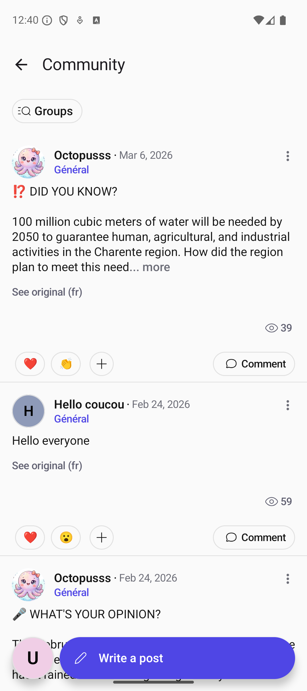
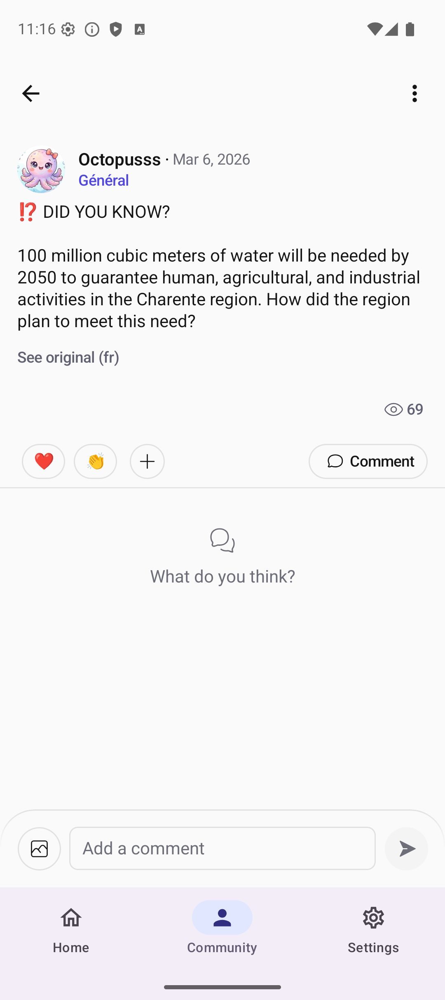
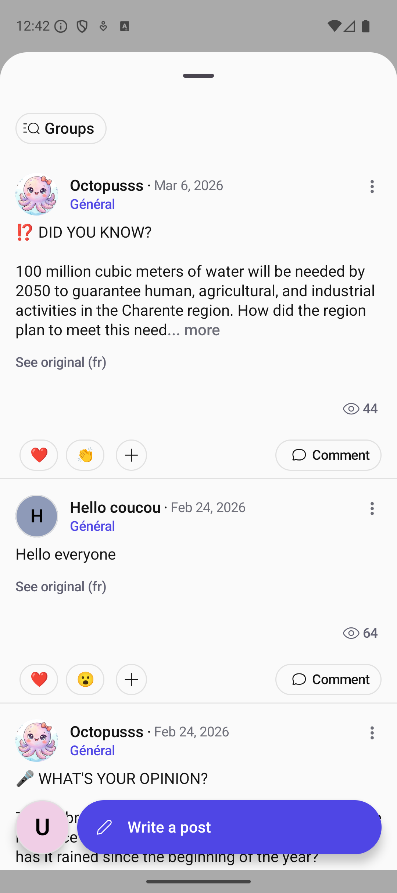

# Octopus SDK for Android

[](https://central.sonatype.com/artifact/com.octopuscommunity/octopus-sdk)
[](https://developer.android.com)
[](https://developer.android.com/tools/releases/platforms)
[](LICENSE.md)

A white-label, moderated in-app community — feed, groups, posts with images and polls,
comments, reactions, profiles and notifications — as native Jetpack Compose screens themed to
your app.

  

## What you get

- **Native Compose UI, no web view.** The screens ship ready to use; colors, typography, top
  bar and logo come from your own design tokens through `OctopusTheme`.
- **Hosted backend.** Octopus runs the servers, storage, moderation and analytics behind the
  community; your app ships the SDK and an API key.
- **Your accounts.** Connect your signed-in users with SSO (a JWT signed by your backend), or
  let Octopus handle sign-in. Profile fields can stay owned by your app.
- **Hooks into your app.** Attach a discussion to your own content (bridge), forward FCM push
  notifications, and observe unread counts, connection state and events as Kotlin `Flow`s.
- **Six navigation patterns** — full screen, tab, nested navigation, bottom sheet and more —
  each a runnable sample in this repository.

## Requirements

| | Minimum |
|---|---|
| Android | `minSdk` 21, `compileSdk` 35 |
| Kotlin | 2.1.10 |
| JVM target | 11 |
| UI | Jetpack Compose + Material3, Navigation Compose |
| API key | One per community — see [Sample app](#sample-app) for a free sandbox key |

## Installation

The artifacts are on Maven Central. In your module's `build.gradle.kts`:

```kotlin
dependencies {
    implementation("com.octopuscommunity:octopus-sdk:1.14.0")
    implementation("com.octopuscommunity:octopus-sdk-ui:1.14.0")
    // Used directly by the Quickstart; the SDK does not expose them to your compile classpath.
    implementation("androidx.activity:activity-compose:1.10.1")
    implementation("androidx.navigation:navigation-compose:2.9.5")
}
```

`octopus-sdk` alone gives you the API (connection, state, bridge, push) without any Compose
dependency; add `octopus-sdk-ui` to display the community.

## Quickstart

Initialize the SDK once, in your `Application` (registered in your manifest):

```kotlin
import com.octopuscommunity.sdk.OctopusSDK
import com.octopuscommunity.sdk.domain.model.ConnectionMode

class MyApp : Application() {
    override fun onCreate() {
        super.onCreate()
        OctopusSDK.initialize(
            context = this,
            apiKey = "YOUR_API_KEY", // read it from BuildConfig in a real app
            connectionMode = ConnectionMode.OctopusAuth,
        )
    }
}
```

Then open the community from any Activity:

```kotlin
import com.octopuscommunity.sdk.ui.home.OctopusHomeScreen
import com.octopuscommunity.sdk.ui.octopusComposables

class CommunityActivity : ComponentActivity() {
    override fun onCreate(savedInstanceState: Bundle?) {
        super.onCreate(savedInstanceState)
        setContent {
            val navController = rememberNavController()
            NavHost(navController = navController, startDestination = "community") {
                composable("community") { OctopusHomeScreen(navController = navController) }
                octopusComposables(navController = navController)
            }
        }
    }
}
```

`ConnectionMode.OctopusAuth` lets Octopus handle sign-in, so no callback is needed. To connect
your own signed-in users, use `ConnectionMode.SSO()`: `onNavigateToLogin` then becomes required
and you call `OctopusSDK.connectUser` with a token from your backend — see
[Setup with SSO](docs/integration-guide.md#setup-with-sso).

## Sample app

The [`samples`](samples) module covers every navigation pattern, plus theming, SSO, the bridge
and push. Each pattern is a build variant: `singleactivity`, `fullscreen`,
`bottomnavigationbar`, `nestednavigation`, `contentpadding`, `modalbottomsheet`. Building it
needs JDK 17 and an Android SDK (or open the project in Android Studio).

```bash
git clone https://github.com/Octopus-Community/octopus-sdk-android.git && cd octopus-sdk-android
echo "OCTOPUS_API_KEY=YOUR_API_KEY" >> local.properties
./gradlew :samples:installFullscreenDebug   # or any other variant, e.g. installModalbottomsheetDebug
```

Get a free sandbox API key from the form on [octopuscommunity.com](https://www.octopuscommunity.com);
it arrives by email within 24 hours. The sample connects users with SSO: to sign in, also set
`OCTOPUS_SSO_CLIENT_USER_TOKEN_SECRET` in `local.properties` (see
[Generate a signed JWT for SSO](https://doc.octopuscommunity.com/backend/sso/)). The sample
signs its own JWT locally for convenience; your app should get it from your backend.

## Links

- [Integration guide](docs/integration-guide.md) — SSO setup, navigation patterns, profile
  management, theming, bridge, push notifications, reactive state, troubleshooting
- [Documentation](https://doc.octopuscommunity.com) — cross-platform guides, JWT and SSO
  backend setup
- [CHANGELOG.md](CHANGELOG.md) · [MIGRATING.md](MIGRATING.md) · [ARCHITECTURE.md](ARCHITECTURE.md)
- [Issues](https://github.com/Octopus-Community/octopus-sdk-android/issues)
- Other Octopus SDKs: [iOS](https://github.com/Octopus-Community/octopus-sdk-swift) ·
  [Flutter](https://github.com/Octopus-Community/octopus-sdk-flutter) ·
  [React Native](https://github.com/Octopus-Community/octopus-sdk-react-native) ·
  [Unity](https://github.com/Octopus-Community/octopus-sdk-unity)

## License

Distributed under the **Octopus Community Mobile SDK License** — see [LICENSE.md](LICENSE.md).
