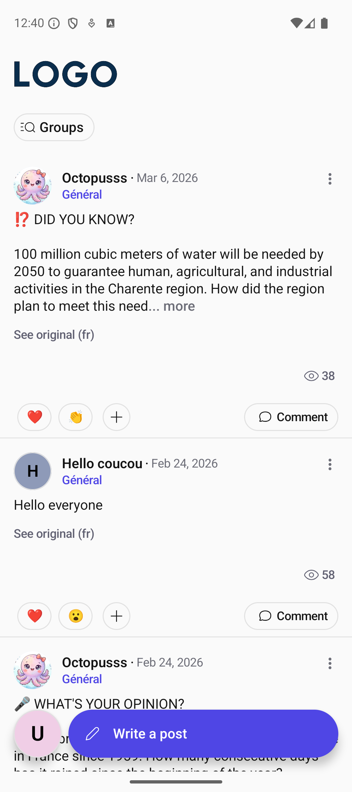
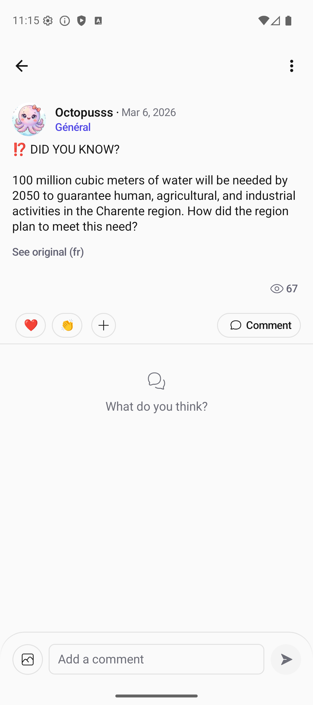
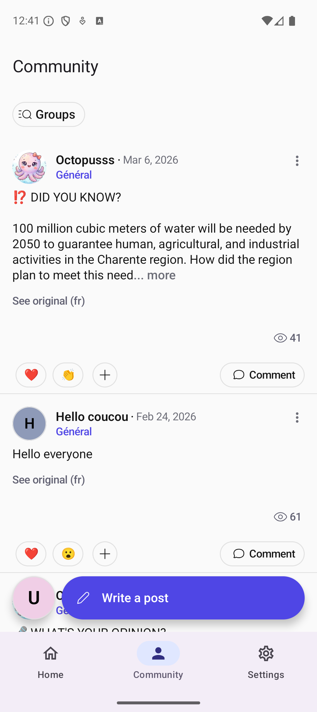
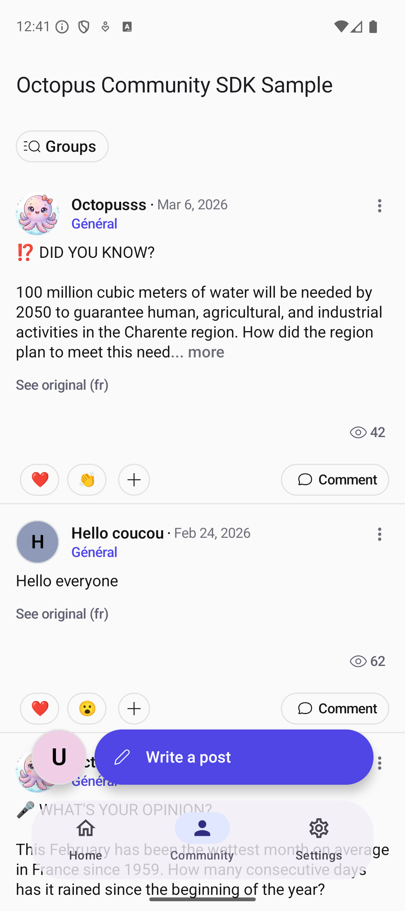

# Integration guide — Octopus SDK for Android

The [README](../README.md) gets a community on screen in a few minutes. This guide covers the
rest of a production integration: connecting your own signed-in users, choosing a navigation
pattern, profile ownership, theming, the bridge, push notifications, reactive state, and
troubleshooting. Cross-platform concepts (JWT signing, SSO, content options) are documented at
[doc.octopuscommunity.com](https://doc.octopuscommunity.com).

Code in this guide targets the version pinned in the [README](../README.md#installation).

## Setup with SSO

Pick the auth mode that matches your app:

- **SSO** — your backend already authenticates users and can mint a JWT for Octopus. Use
  `ConnectionMode.SSO` + `connectUser`.
- **Octopus Auth** — let Octopus handle sign-in via magic-link email. Use
  `ConnectionMode.OctopusAuth` and skip step 3 entirely.

### 1. Initialize once at startup

```kotlin
class MyApplication : Application() {

    override fun onCreate() {
        super.onCreate()

        OctopusSDK.initialize(
            context = this,
            apiKey = BuildConfig.OCTOPUS_API_KEY,
            // Octopus manages the whole profile by default. If your app owns some
            // profile fields, pass them — see "Profile management" below.
            connectionMode = ConnectionMode.SSO()
        )
    }
}
```

Never hardcode the API key in source. Read it from `local.properties` into `BuildConfig`,
as the [samples](../samples/build.gradle.kts) do.

### 2. Show the community

`OctopusHomeScreen` is a complete screen with its own Scaffold and top bar. Add
`octopusComposables()` to the same `NavHost` so the SDK's own sub-screens (post details,
profiles, create post) have somewhere to go:

```kotlin
val navController = rememberNavController()

NavHost(navController = navController, startDestination = "Home") {
    composable("Home") {
        OctopusHomeScreen(
            modifier = Modifier.fillMaxSize(),
            navController = navController,
            onNavigateToLogin = { /* start your login flow */ },
            onNavigateToProfileEdit = { fieldToEdit -> /* start your profile editor */ }
        )
    }

    octopusComposables(
        navController = navController,
        onNavigateToLogin = { /* start your login flow */ },
        onNavigateToProfileEdit = { fieldToEdit -> /* start your profile editor */ }
    )
}
```

That is the full integration for an SSO host with anonymous browsing. Authenticated users
come next.

### 3. Connect the signed-in user (SSO)

When your user logs into your app, hand Octopus a JWT signed by your backend. Pass a
**token provider**, not a static token, so the SDK can re-mint the JWT when entitlements
change:

```kotlin
OctopusSDK.connectUser(
    user = ClientUser(
        userId = user.id,
        profile = ClientUser.Profile(
            nickname = user.nickname,
            bio = user.bio,
            picture = user.pictureUrl?.let { Resource.Remote(it) }
        )
    ),
    tokenProvider = { myBackend.mintOctopusJwt(user.id) }
)
```

On sign-out:

```kotlin
OctopusSDK.disconnectUser()
```

Both are `suspend` functions — call them from a coroutine.

## Integration patterns

The SDK provides two entry composables:

- **`OctopusHomeScreen`** — a complete screen with its own Scaffold and top bar. Drop it in
  and you're done.
- **`OctopusHomeContent`** — just the content, without a Scaffold. Embed it inside your own
  layout (tabs, sheets, custom scaffolds).

Pick the pattern below that best matches your app's navigation. Each one is a compilable
sample in this repo — see [Sample app](../README.md#sample-app) to run them.

---

#### 1. Single Activity (Standalone Community)

Use `OctopusHomeScreen` as the sole content of a dedicated Activity. Best when the community
IS the app or is launched as a standalone screen.



**Best for:** Apps where the community is the primary (or only) feature.

- [Single Activity Sample](../samples/src/singleactivity/java/com/octopuscommunity/sample/CommunityActivity.kt)

---

#### 2. Full Screen Navigation

Add `OctopusHomeContent` to a dedicated full-screen route, just like any other composable
screen in your app.


**Best for:** Apps where community is a primary feature with equal prominence to other main sections.

- [Full Screen Sample](../samples/src/fullscreen/java/com/octopuscommunity/sample/screens/MainScreen.kt)

---

#### 3. Bottom Navigation Tabs + Full Screen Sub Navigation

Integrate the community as a tab in a bottom navigation alongside your other main sections.
Octopus sub-screens launch in full screen.

 

**Best for:** Apps with 2-5 main sections where community deserves a dedicated, always-accessible tab.

- [Bottom Navigation Tabs + Full Screen Sample](../samples/src/bottomnavigationbar/java/com/octopuscommunity/sample/screens/MainScreen.kt)

---

#### 4. Bottom Navigation Tabs + Nested Sub Navigation

Integrate the community as a tab in a bottom navigation alongside your other main sections.
Octopus sub-screens navigate within the same `NavHost` using `octopusComposables()`.

 

**Best for:** Apps that want full control over navigation transitions and need SDK screens to coexist in the same navigation graph.

- [Bottom Navigation Tabs + Nested Navigation Sample](../samples/src/nestednavigation/java/com/octopuscommunity/sample/screens/MainScreen.kt)

---

#### 5. Floating Bottom Navigation

Similar to bottom navigation tabs but with custom content padding to add space around the
edges of the content (e.g., rounded navigation bar with margins).



**Best for:** Apps requiring custom navigation bar styling that matches a specific design system.

- [Floating Bottom Navigation Sample](../samples/src/contentpadding/java/com/octopuscommunity/sample/screens/MainScreen.kt)

---

#### 6. Modal Bottom Sheet

Display the community in a modal bottom sheet that overlays your content. Users can swipe
down to dismiss.


**Best for:** Apps where community is a secondary feature accessed occasionally, without disrupting the main flow.

- [Modal Bottom Sheet Sample](../samples/src/modalbottomsheet/java/com/octopuscommunity/sample/screens/MainScreen.kt)

## Profile management

Configure which profile fields your app owns and which ones Octopus Community owns, via
`appManagedFields` on `ConnectionMode.SSO`. Three shapes, matching how your community is
configured on the backend:

#### 1. Octopus-Managed Profile (no app-managed fields)

All profile fields are managed by Octopus Community. Info you provide in `connectUser` is
only used as prefilled values when the user creates their community profile. Fields are not
synchronized between your app and community profile.

**Requirements:** your community must be configured with no app-managed fields.

#### 2. Hybrid Profile (some app-managed fields)

Some profile fields are managed by your app. These fields will be used in the community.
Octopus Community won't moderate app-managed fields. If nickname is app-managed, you must
ensure it's unique.

**Requirements:** your community must be configured with some app-managed fields, and you
must declare them in `OctopusSDK.initialize()`.

#### 3. Client-Managed Profile (all app-managed fields)

All profile fields are managed by your app. Your user profile is used directly in the
community. Octopus Community won't moderate any profile content. You must ensure nickname
uniqueness.

**Requirements:** your community must be configured with all fields as app-managed, and you
must set all of them in `OctopusSDK.initialize()`.

Full reference: [SSO documentation](https://doc.octopuscommunity.com/SDK/sso?platform=android).

## Theming

Wrap the SDK composables in `OctopusTheme` to override colors, typography, top app bar, and
logo:

```kotlin
@Composable
fun CommunityTheme(content: @Composable () -> Unit) {
    OctopusTheme(
        colorScheme = if (isSystemInDarkTheme()) {
            octopusDarkColorScheme(
                primary = Color(0xFF818CF8),
                primaryLow = Color(0xFF1E1B4B),
                primaryHigh = Color(0xFFC7D2FE),
                onPrimary = Color(0xFF1E1B4B),
                background = Color(0xFF111118)
            )
        } else {
            octopusLightColorScheme(
                primary = Color(0xFF4F46E5),
                primaryLow = Color(0xFFE0E7FF),
                primaryHigh = Color(0xFF6366F1),
                onPrimary = Color(0xFFFFFFFF),
                background = Color(0xFFFAFAFA)
            )
        },
        images = OctopusImagesDefaults.images(
            logo = { painterResource(R.drawable.ic_logo) }
        ),
        content = content
    )
}
```

Every slot has a `*Defaults` factory returning the SDK's own value, so you override only what
you need and inherit the rest:

- `colorScheme` — `octopusLightColorScheme()` / `octopusDarkColorScheme()`
- `typography` — `OctopusTypographyDefaults.typography()`, with the slots `title1`, `title2`,
  `body1`, `body2`, `caption1`, `caption2`
- `topAppBar` — `OctopusTopAppBarDefaults.topAppBar()`, for the title, navigation icon,
  actions and colors
- `images` — `OctopusImagesDefaults.images()`, for the logo

The fastest way to iterate is
[`OctopusThemeConfigurator.kt`](../tools/src/main/java/com/octopuscommunity/tools/OctopusThemeConfigurator.kt)
in this repo: it holds the theme above plus a `@Preview` for every SDK screen, so you can
see your brand applied across the whole community without running the app.

## Bridge: link your content to a discussion

If your app already has its own content (articles, products, events), the **bridge** lets you
attach a community discussion to each item. Call once to get the related post, then display
its details inside your own Scaffold:

```kotlin
OctopusSDK.fetchOrCreateClientObjectRelatedPost(
    clientPost = ClientPost(
        objectId = article.id,
        text = article.title,
        attachment = article.imageUrl?.let { Resource.Remote(url = it) },
        catchPhrase = article.subtitle,
        viewObjectButtonText = "Read the article"
    )
)
```

Observe it, then render it:

```kotlin
val post by OctopusSDK.getClientObjectRelatedPostFlow(article.id).collectAsState(null)

post?.let { octopusPost ->
    OctopusPostDetailsContent(
        navController = navController,
        postId = octopusPost.id,
        onNavigateToLogin = { /* start your login flow */ },
        onNavigateToProfileEdit = { fieldToEdit -> /* start your profile editor */ }
    )
}
```

Wire the "view object" button so a tap returns to your own screen, via
`onNavigateToClientObject` on `OctopusHomeScreen` / `OctopusHomeContent`.

- [Bridge Post Sample](../samples/src/main/java/com/octopuscommunity/sample/screens/bridge/CommunityPostScreen.kt)

## Push notifications

Register your `FirebaseMessagingService` in `AndroidManifest.xml`:

```xml
<service
    android:name=".messaging.MessagingService"
    android:exported="false">
    <intent-filter>
        <action android:name="com.google.firebase.MESSAGING_EVENT" />
    </intent-filter>
</service>
```

Forward the FCM token, and let the SDK tell you when a payload is its own:

```kotlin
class MessagingService : FirebaseMessagingService() {

    override fun onNewToken(token: String) {
        super.onNewToken(token)
        OctopusSDK.registerNotificationsToken(token)
    }

    override fun onMessageReceived(remoteMessage: RemoteMessage) {
        super.onMessageReceived(remoteMessage)
        val notification = OctopusSDK.getOctopusNotification(data = remoteMessage.data)
            ?: return // not ours — handle your own payloads here

        getSystemService<NotificationManager>()?.notify(
            notification.id,
            NotificationCompat.Builder(this, CHANNEL_ID)
                .setAutoCancel(true)
                .setOctopusContent(
                    context = this,
                    activityClass = MainActivity::class,
                    octopusNotification = notification
                )
                .build()
        )
    }
}
```

`setOctopusContent` fills in the title, body and the deep link that opens the right community
screen on tap. See the
[MessagingService implementation](../samples/src/main/java/com/octopuscommunity/sample/messaging/MessagingService.kt)
for channel creation and token refresh.

## Reactive state

The SDK exposes its world as Kotlin `Flow`s, so your own UI can react without polling:

| Flow | Emits |
|---|---|
| `OctopusSDK.isInitialisedFlow` | `Boolean` — SDK initialized state |
| `OctopusSDK.connectionState` | `ConnectionState` — connected / guest / not connected |
| `OctopusSDK.isUserConnected` | `Boolean` — shorthand for the above |
| `OctopusSDK.profile` | `OctopusProfile?` — current user, or `null` |
| `OctopusSDK.notSeenNotificationsCount` | `Int` — unread badge count |
| `OctopusSDK.groups` | `List<OctopusGroup>` — community groups |
| `OctopusSDK.hasAccessToCommunity` | `Boolean` — whether this user may enter the community |
| `OctopusSDK.events` | `OctopusEvent` — typed analytics-grade event stream |

Example: keep a badge updated.

```kotlin
val unread by OctopusSDK.notSeenNotificationsCount.collectAsState(0)

BadgedBox(badge = { if (unread > 0) Badge { Text("$unread") } }) {
    Icon(Icons.Default.Notifications, contentDescription = null)
}
```

The count is cached; call `OctopusSDK.updateNotSeenNotificationsCount()` to refresh it from
the backend (e.g. on app resume).

## What else is in the box

Things you don't need on day one, but will probably want later — full reference at
[doc.octopuscommunity.com](https://doc.octopuscommunity.com):

- **Multi-community switching** — `OctopusSDK.switchCommunity(context, apiKey, ...)` swaps the
  SDK to another community at runtime.
- **Reactions** — `OctopusSDK.setReaction(OctopusReactionKind.Heart, postId)` (or `null` to
  remove).
- **Programmatic group follow / unfollow** — `followGroup`, `unfollowGroup`, and
  `syncFollowGroups` to push the group selection the user made in *your* UI.
- **Locked groups** — `OctopusSDK.setGroupAccessDeniedCallback { groupId -> ... }` to show your
  own paywall when a user taps a group they cannot access.
- **URL interception** — `onNavigateToUrl` on the home composables returns
  `UrlOpeningStrategy.HandledByApp` or `.HandledByOctopus`.
- **Deep links** — `OctopusSDK.initialize(deepLinksBasePaths = ...)` so Octopus links resolve
  to your own domain.
- **Locale override** — `OctopusSDK.overrideDefaultLocale(Locale.FRENCH)`. The override is
  persisted, so it outlives the process.
- **Refresh entitlements** — `OctopusSDK.refreshEntitlements()` re-mints the JWT through your
  token provider when your backend changes what the user is entitled to.
- **Custom analytics** — `OctopusSDK.track(TrackerEvent.Custom(...))`.
- **Community access override** — `OctopusSDK.overrideCommunityAccess(hasAccess)` takes full
  precedence over the backend value, for A/B rollouts.
- **Compose previews without a backend** — the `octopus-sdk` artifact ships `MockPosts`,
  `MockComments` and friends under `com.octopuscommunity.sdk.test.mock`, so your `@Preview`s
  render real-looking content.

## Troubleshooting

- **The community screen is blank** — check that `OctopusSDK.initialize()` ran before the
  screen was composed. `isInitialisedFlow` tells you whether it did.
- **Nothing happens when the user taps a post, a profile, or "create post"** — you're missing
  `octopusComposables()` in the `NavHost` that owns the community route. The SDK navigates to
  its own destinations; they have to be registered.
- **`MissingOnNavigateToLoginException` when a community screen renders** — in SSO mode (the
  default `ConnectionMode.SSO()`), `onNavigateToLogin` is required on `OctopusHomeScreen`,
  `OctopusHomeContent` and `octopusComposables()`: the SDK hands sign-in to your app and cannot
  proceed without the callback. Pass it, or use `ConnectionMode.OctopusAuth` to let Octopus
  handle sign-in. Likewise, `MissingOnNavigateToProfileEditException` means your
  `appManagedFields` are non-empty and `onNavigateToProfileEdit` is missing.
- **"Invalid token" / connection refused** — verify your API key, and that your
  `tokenProvider` returns an unexpired JWT signed with the shared secret. The SDK re-invokes
  it on every refresh (e.g. `refreshEntitlements()`).
- **A user sees an empty community** — check `hasAccessToCommunity`: the backend can withhold
  access, and `overrideCommunityAccess()` takes precedence over it.

More: [doc.octopuscommunity.com](https://doc.octopuscommunity.com).
